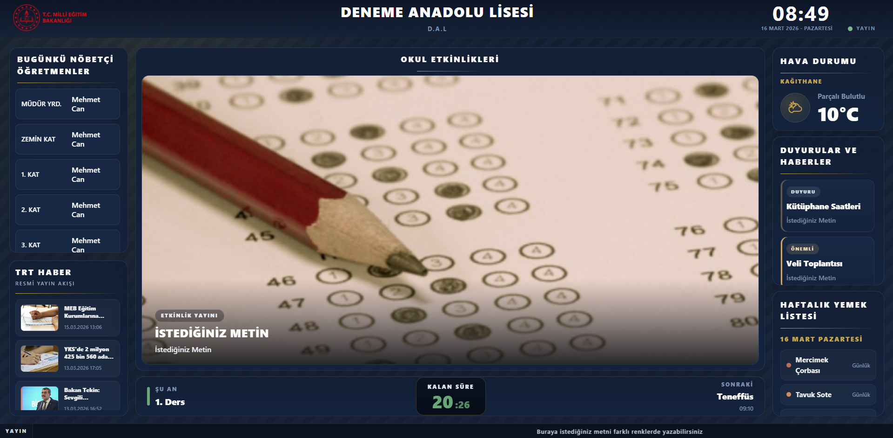
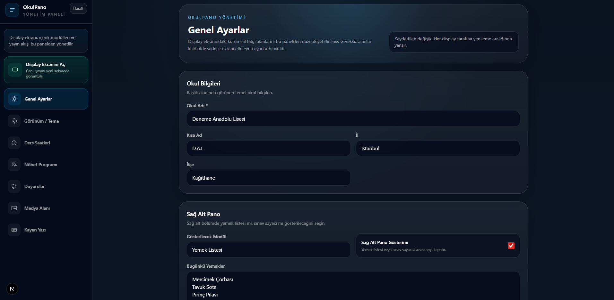
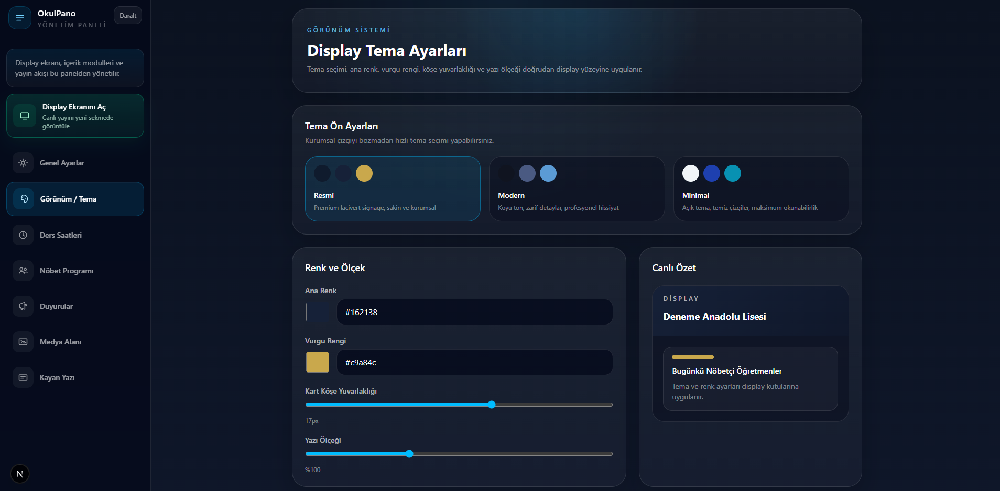

# OkulPano

OkulPano, Millî Eğitim Bakanlığı okullarındaki koridor, giriş, öğretmenler odası ve ortak alan ekranlarında kullanılmak üzere geliştirilen açık kaynak bir dijital bilgilendirme ekranı uygulamasıdır.

Uygulama; okul içinde sürekli açık kalan televizyonlar veya ekranlar üzerinde `/display` yüzeyinin çalıştırılması, içeriklerin ise yönetim panelinden kolayca güncellenmesi mantığıyla tasarlanmıştır.

Ticari SaaS modeliyle değil; düşük bakım gerektiren, yerel ağ içinde çalışabilen, kurulumu sade ve ücretsiz bir okul içi signage çözümü olarak geliştirilmiştir.

## Ekran Görüntüleri

### Display Ekranı

  

### Yönetim Paneli

## Neden OkulPano?

* Açık kaynak ve ücretsizdir
* Yerel kullanım için tasarlanmıştır
* Ek sunucu veya karmaşık servis bağımlılığı gerektirmez
* Okul içi televizyon ekranlarında sürekli açık çalışabilir
* Yönetim paneli ile içerikler hızlı şekilde güncellenebilir
* Kurumsal, sade ve okunabilir bir ekran dili sunar

## Temel kullanım modeli

1. Yönetim paneli bilgisayarda açılır
2. İçerikler admin panelinden güncellenir
3. `/display` ekranı televizyona verilir
4. Tarayıcı tam ekran modunda sürekli çalıştırılır

## Öne çıkan modüller

* Günün nöbetçi öğretmenleri
* Duyurular
* Medya alanı
* Ders saatleri ve kalan süre
* Kayan yazı bandı
* Hava durumu
* TRT Haber haber alanı
* Sağ alt modül: yemek listesi, YKS sayacı veya LGS sayacı

## Teknoloji yığını

* Next.js 16
* React 19
* Tailwind CSS 4
* Prisma
* SQLite

## Veri kaynakları

OkulPano içeriğinin bir bölümü yönetim panelinden girilir, bir bölümü dış veri kaynaklarından alınır.

* Nöbetçi öğretmenler, duyurular, medya, ders saatleri, ticker ve yemek listesi: yönetim panelinden girilir
* TRT Haber akışı RSS üzerinden alınır
* Hava durumu verileri Open-Meteo servislerinden alınır
* İl ve ilçe seçimi proje içine eklenmiş statik Türkiye ilçe listesi ile desteklenir

Not: İnternet bağlantısı olmayan ortamlarda dış veri kullanan modüller güncellenmez; display ekranında veri güncellenemedi uyarısı gösterilir.

## Kurulum

### Gereksinimler

* Node.js 20 veya üzeri
* npm
